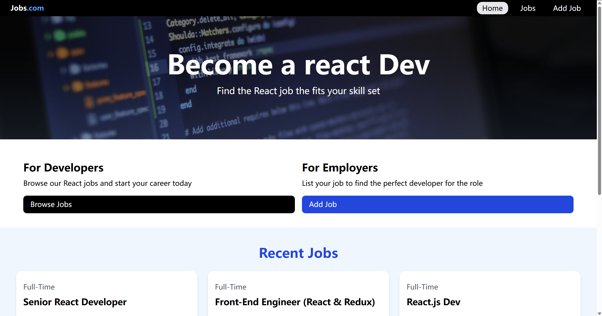

# Front-end

## Preview 0_Album
https://front-end-beta-olive.vercel.app/

## Preview 1_Portfolio
https://front-end-em47.vercel.app/

## Preview 2_Form
https://front-end-yd7u.vercel.app/

reference:https://www.youtube.com/watch?v=Z_AbWH-Vyl8

## Preview 3_Chatbot
https://front-end-e8fl.vercel.app/

## Preview 4_Downward_sideBar
https://front-end-xn3s.vercel.app/

## Project 6_react_hero_ui

    a project follwed Traversy Media course: https://www.youtube.com/watch?v=LDB4uaJ87e0&t=4685s
    using: tailwindCss + heroUI + JSON server + toastify
    
    --Usage
    This project uses JSON-Server for a mock backend.

    --Install Dependencies
    npm install
    
    --Run JSON Server
    The server will run on http://localhost:8000
    npm run server
    
    --Run Vite Frontend
    React will run on http://localhost:3000
    npm run dev
    
    --Build for Production
    npm run build
    
    --Preview Production Build
    npm run preview

## 7_react_film
    using: appwrite 